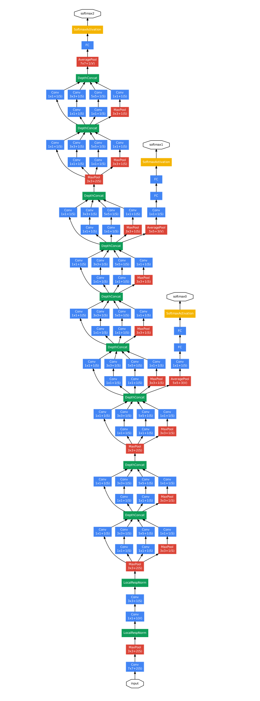

# Inception

??? cite "Bharath Raj's explaination of Inception network"
    https://towardsdatascience.com/a-simple-guide-to-the-versions-of-the-inception-network-7fc52b863202

## Inception v1

Very deep networks are prone to overfitting. It also hard to pass gradient updates through the entire network.

{align="right" width="40%"}

This was popularly known as GoogLeNet (Inception v1). The architecture is shown right.
GoogLeNet has 9 such inception modules stacked linearly. It is 22 layers deep (27, including the pooling layers). It uses global average pooling at the end of the last inception module.

!!! cite "Paper"
    [Szegedy, Christian et al. 2015. “Going Deeper with Convolutions.” Proceedings of the IEEE Computer Society Conference on Computer Vision and Pattern Recognition 07-12-June-2015: 1–9.](https://arxiv.org/pdf/1409.4842v1.pdf)

## Inception v2 & v3

!!! cite "Paper"
    [Szegedy, Christian et al. 2016. “Rethinking the Inception Architecture for Computer Vision.” Proceedings of the IEEE Computer Society Conference on Computer Vision and Pattern Recognition 2016-December: 2818–26.](https://arxiv.org/pdf/1512.00567v3.pdf)

## Quick References

#### representational bottleneck
    
Reduce representational bottleneck. The intuition was that, neural networks perform better when convolutions didn’t alter the dimensions of the input drastically. Reducing the dimensions too much may cause loss of information, known as a “representational bottleneck”

