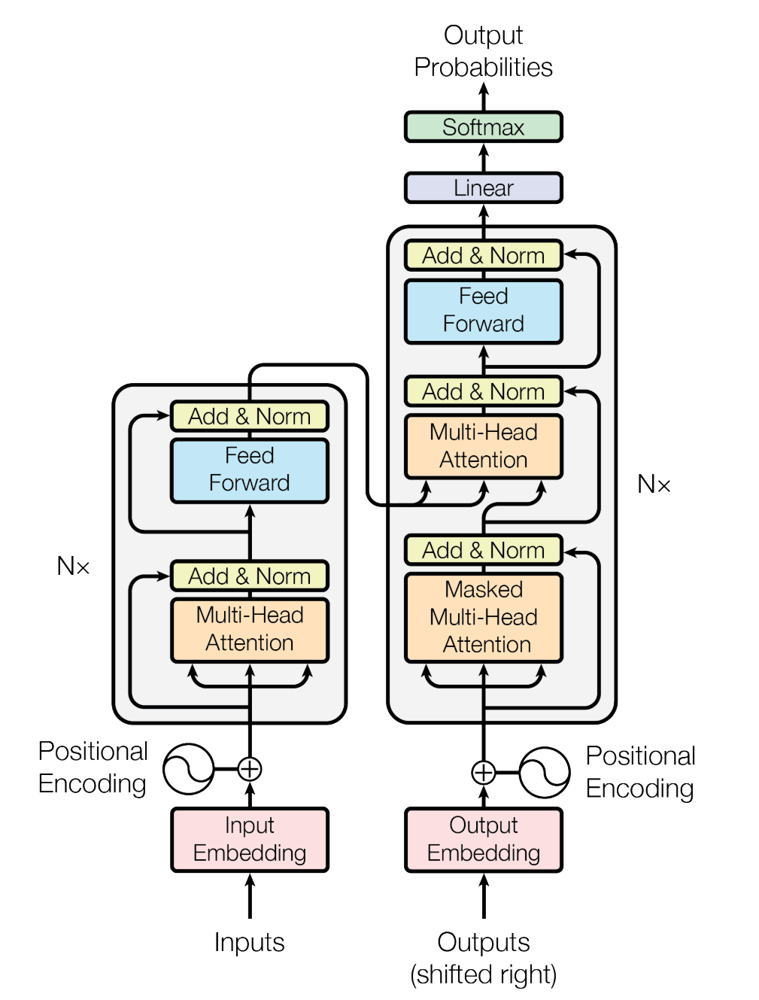
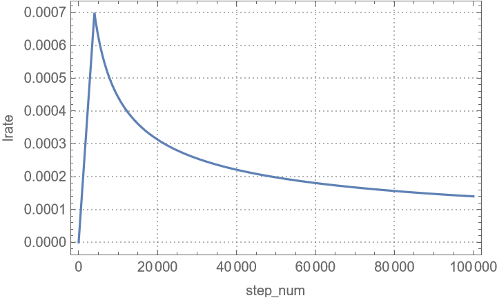

# Transformer

??? cite "Vaswani, Ashish et al. 2017. “Attention Is All You Need.” Advances in Neural Information Processing Systems 2017-Decem(Nips): 5999–6009. http://arxiv.org/abs/1706.03762."
    The dominant sequence transduction models are based on complex recurrent or convolutional neural networks in an encoder-decoder configuration. The best performing models also connect the encoder and decoder through an attention mechanism. We propose a new simple network architecture, the Transformer, based solely on attention mechanisms, dispensing with recurrence and convolutions entirely. Experiments on two machine translation tasks show these models to be superior in quality while being more parallelizable and requiring significantly less time to train. Our model achieves 28.4 BLEU on the WMT 2014 English-to-German translation task, improving over the existing best results, including ensembles by over 2 BLEU. On the WMT 2014 English-to-French translation task, our model establishes a new single-model state-of-the-art BLEU score of 41.8 after training for 3.5 days on eight GPUs, a small fraction of the training costs of the best models from the literature. We show that the Transformer generalizes well to other tasks by applying it successfully to English constituency parsing both with large and limited training data.

{align=right width="50%"}

Before transformers, most state-of-the-art NLP systems relied on gated RNNs, such as LSTM and gated recurrent units (GRUs), with added attention mechanisms. Transformers are built on these attention technologies without using an RNN structure, highlighting the fact that attention mechanisms alone can match the performance of RNNs with attention.

Like recurrent neural networks (RNNs), transformers are designed to handle sequential input data, such as natural language, for tasks such as translation and text summarization. However, unlike RNNs, transformers do not necessarily process the data in order. Rather, the attention mechanism provides context for any position in the input sequence. For example, if the input data is a natural language sentence, the transformer does not need to process the beginning of the sentence before the end. Rather it identifies the context that confers meaning to each word in the sentence. This feature allows for more parallelization than RNNs and therefore reduces training times.

## Training

### Optimizer


$$
\text{lrate} = d_{model}^{-0.5} \cdot \min (\text{step_num}^{-0.5}, \text{step_num}\cdot\text{warmup_steps}^{-1.5})
$$

where $\text{warmup_step}$ used in paper is 4000, $d_{model} = 512$.

=== "plot"
    <span style="display:block; text-align: center;">
    {width="500px"}
    </span>

=== "Mathematica"
    ```mathematica
    Module[{dModel = 512, warmupSteps = 4000},
        Plot[dModel^-0.5 Min[stepNum^-0.5, stepNum warmupSteps^-1.5], {stepNum, 0, 10^5},
            PlotRange -> All, PlotTheme -> "Detailed", FrameLabel -> {"step_num", "lrate"}]
    ]
    ```


## Implementation

- [leviswind/pytorch-transformer](https://github.com/leviswind/pytorch-transformer)
